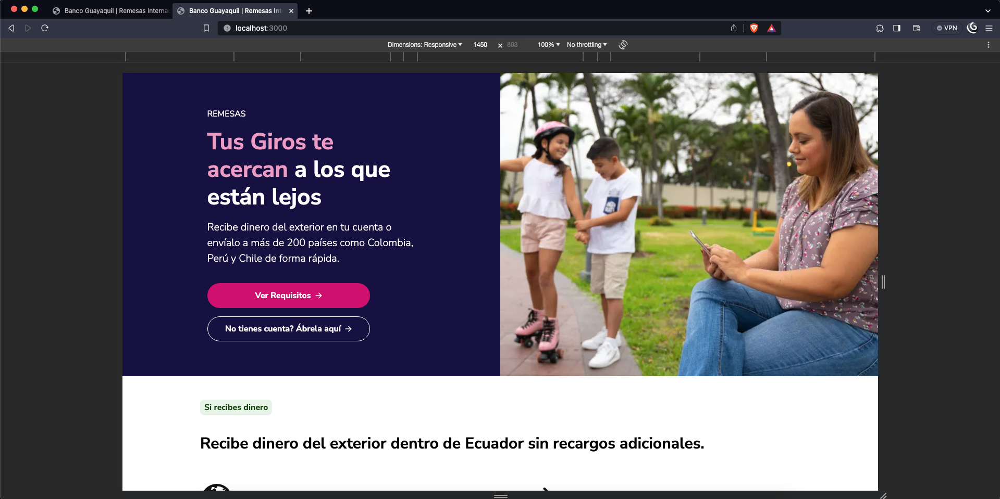
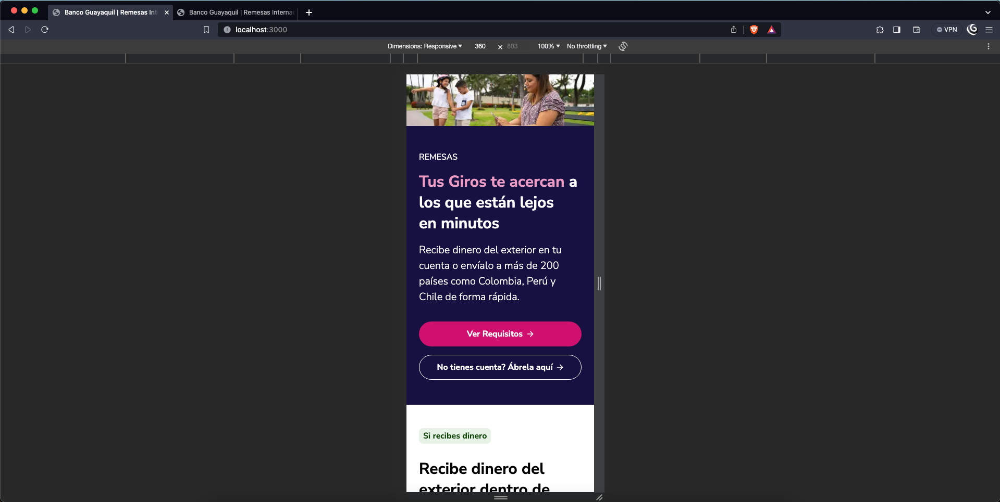

# PRUEBA TECNICA FRONTEND DE BANCO GUAYAQUIL | INTELNEXO

## Descripción

Este proyecto es una prueba técnica para el cargo de Frontend Developer en Banco Guayaquil. El proyecto consiste en el diseño y desarrollo de una landing page para la promoción de remesas. Se proporciona un diseño en Figma y se debe desarrollar la página web en ReactJS.

## Instalación

Para instalar el proyecto, se debe clonar el repositorio y ejecutar el comando `bun install` o `npm install` para instalar las dependencias del proyecto.

## Ejecución

Para ejecutar el proyecto, se debe ejecutar el comando `npm run dev` y se abrirá una ventana en el navegador con la página web.

## Tecnologías

- ReactJS
- NextJS
- Sass
- Figma
- TailwindCSS

## Autor

- [Kevin Hernandez](https://linkedin.com/in/kevinhc23)

## Licencia

[MIT](https://opensource.org/licenses/MIT)

## Demo

[Diseño Web Desplegado en Vercel](https://lading-page-bg.vercel.app/)

### Diseño en pantalla de escritorio

### Diseño en pantalla de móvil

